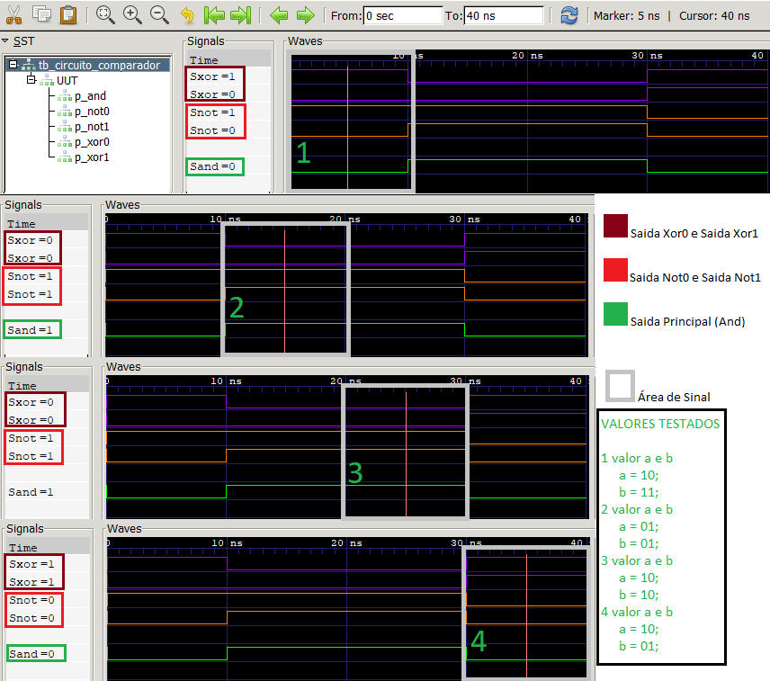

# **📌 Documentação do Comparador de 2 Bits**  
### *Um projeto simples, mas eficiente para verificar igualdade entre números binários*  

---

## **🎯 Introdução**  
O projeto a seguir propõe a implementação de um comparador lógico para números de 2 bits, com foco em clareza e desempenho. A arquitetura emprega apenas componentes lógicos fundamentais, tornando-o ideal para fins educacionais, testes em FPGA ou aplicações digitais simples. 

Desenvolvido em **SystemVerilog**, este comparador é:  
✔ **Simples** (usa apenas portas lógicas básicas)  
✔ **Eficiente** (resultado em apenas alguns nanossegundos)  
✔ **Fácil de entender** (modular e bem documentado)  

**Funcionamento básico:**  
🔹 Entrada: Dois números de 2 bits (`A` e `B`)  
🔹 Saída: `1` se forem iguais, `0` se forem diferentes  

---

## **🔧 Como o Código Funciona?**  

### **1️⃣ Portas Lógicas Básicas**  
O circuito usa três componentes essenciais:  

#### **🔹 Porta XOR (OU Exclusivo)**  
```systemverilog
module porta_xor(
  input A,B,
  output Sxor
);
  assign Sxor = A ^ B;
endmodule
```
- **O que faz?** Compara dois bits e "avisa" se são diferentes.  
- **Exemplo:**  
  - `0 XOR 0 = 0` (iguais)  
  - `1 XOR 0 = 1` (diferentes)  

#### **🔹 Porta NOT (Inversor)**  
```systemverilog
module porta_not(
  input X,
  output Snot
); 
  assign Snot = ~X;
endmodule
```
- **Para que serve?** Transforma uma comparação "diferente" em "igual".  

#### **🔹 Porta AND**  
```systemverilog
module porta_and(
  input A,B,
  output Sand
);
  assign Sand = A & B; 
endmodule
```
- **Missão:** Só libera um `1` na saída se **todos os bits forem iguais**.  

---

### **2️⃣ O Coração do Comparador (`main`)**  
```systemverilog
module main(
  input [1:0] A,
  input [1:0] B,
  output S
);
  logic sXor0,sXor1,sNot0,sNot1,out;
  porta_xor p_xor0(A[0],B[0],sXor0);
  porta_xor p_xor1(A[1],B[1],sXor1);
  porta_not p_not0(sXor1,sNot1);
  porta_not p_not1(sXor0,sNot0);
  porta_and p_and(sNot0,sNot1,out);
  assign S = out;
endmodule
```

#### **📌 Exemplo Prático**  
Se `A = 10` e `B = 10`:  
1. **Bit 0:** `0 XOR 0 = 0` → NOT `0` = `1`  
2. **Bit 1:** `1 XOR 1 = 0` → NOT `0` = `1`  
3. **AND final:** `1 AND 1 = 1` → **Saída = 1 (iguais!)**  

Se `A = 10` e `B = 01`:  
1. **Bit 0:** `0 XOR 1 = 1` → NOT `1` = `0`  
2. **Bit 1:** `1 XOR 0 = 1` → NOT `1` = `0`  
3. **AND final:** `0 AND 0 = 0` → **Saída = 0 (diferentes!)**  

---

## **🧪 Testes e Simulação**  

### **🔹 Testbench (Banco de Testes)**  
```systemverilog
`timescale 1ns/1ns
`include "circuito_comparador.sv"

module tb_circuito_comparador;

logic [1:0] a,b;
logic x;

main UUT(
    .A(a),
    .B(b),
    .S(x)
);

initial begin
     $dumpfile("simulador.vcd");
     $dumpvars(0,tb_circuito_comparador);
     a = 10;
     b = 11;
     #10
     a = 01;
     b = 01;
     #10
     a = 10;
     b = 10;
     #10
     a = 10;
     b = 01;
     #10
     $finish;
end
endmodule
```

### **🔹 Como Rodar os Testes?**
OBS: Pode rodar através do “compile.bat” incluso no projeto. Ou seguir o passo a passo abaixo:

1. **Compilar:**  
   ```bash
   iverilog -g2012 -o <NomeProArquivo> .\tb_circuito_comparador.sv
   ```
2. **Simular:**  
   ```bash
   vvp <NomeDadoAoArquivo>
   ```
3. **Visualizar no GTKWave:**  
   ```bash
   gtkwave simulador.vcd
   ```

### **📊 Resultados Esperados**  


| **Caso** | **Entrada A** | **Entrada B** | **Saída S** | **Significado** |
|---------|--------------|--------------|-------------|----------------|
| 1       | 10           | 11           | 0           | ❌ Diferentes   |
| 2       | 01           | 01           | 1           | ✔ Iguais       |
| 3       | 10           | 10           | 1           | ✔ Iguais       |
| 4       | 10           | 01           | 0           | ❌ Diferentes   |
---
## **📌 Conclusão**  
Este comparador é **fácil de entender, modular e eficiente**. Pode ser usado em:  
- **Unidades de controle de processadores**  
- **Sistemas de verificação de dados**  
- **Circuitos digitais educacionais**  
---
### **📎 Anexos**  
- [Repositório GitHub do Projeto](https://github.com/jhacksonh/Circuito_Comparador_2bits_EmbarcaTech_T2.git)

**👨💻 Autor:** Jacson Souza Dos Santos  
**📅 Data:** 09/05/2025
---